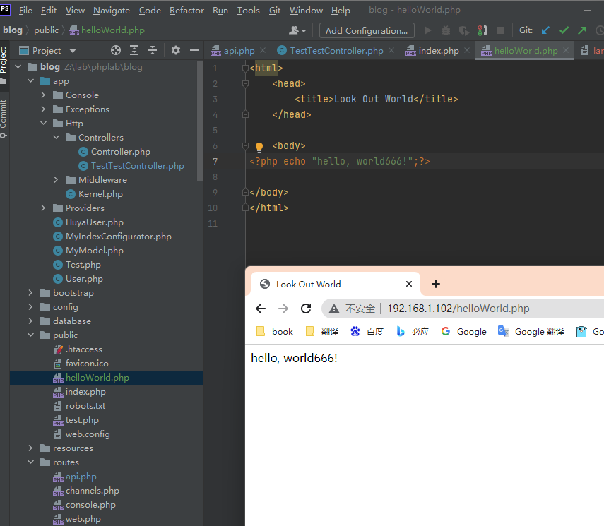

#  PHP学习总结
php语法总结

[TOC]


## 基本语法

PHP 脚本可以放在文档中的任何位置。

PHP 脚本以 **<?php** 开始，以 **?>** 结束：

```php
<?php
// PHP 代码
?>
```

实例：

```php
<!DOCTYPE html>
<html>
<body>

<h1>My first PHP page</h1>

<?php
echo "Hello World!"; // PHP 中的每个代码行都必须以分号结束。
?>
 
</body>
</html>
```


## 变量类型—数据类型

PHP 是一门弱类型语言

在上面的实例中，我们注意到，不必向 PHP 声明该变量的数据类型。

PHP 会根据变量的值，自动把变量转换为正确的数据类型。

在强类型的编程语言中，我们必须在使用变量前先声明（定义）变量的类型和名称。

- 变量

    PHP 变量规则：

    - **变量以 $ 符号开始**，后面跟着变量的名称

    - 变量名必须以字母或者下划线字符开始

    - 变量名只能包含字母、数字以及下划线（A-z、0-9 和 _ ）

    - 变量名不能包含空格

    - 变量名是区分大小写的（$y 和 $Y 是两个不同的变量）

        ```php
        <!DOCTYPE html>
        <html lang="en">
        <head>
        </head>
        <body>
        
        <div>6666666666666666</div>
        <?php
        $x=5;
        $y=6;
        $z=$x+$y;
        echo $z;
        ?>
        </body>
        </html>
        ```
    
- PHP变量作用域
  
  - local
  - global
  - static
  - parameter

  局部变量

  ```php
  <?php
  $x=5; // 全局变量
  
    function myTest()
  {
        $y=10; // 局部变量
      echo "<p>测试函数内变量:<p>";
        echo "变量 x 为: $x";
      echo "<br>";
        echo "变量 y 为: $y";
  } 
    
  myTest();
    
  echo "<p>测试函数外变量:<p>";
    echo "变量 x 为: $x";
  echo "<br>";
    echo "变量 y 为: $y";
  ?>
  ```

    通过 global调用函数外定义的全局变量

  ```php
  <?php
  $x=5;
  $y=10;
   
  function myTest()
  {
      global $x,$y;
      $y=$x+$y;
  }
   
  myTest();
  echo $y; // 输出 15
  ?>
  ```
  
- Static 作用域

  通过 **static** 关键字让一个函数完成时，它的所有变量不会被删除。

  ```php
  <?php
  function myTest()
  {
      static $x=0;
      echo $x;
      $x++;
      echo PHP_EOL;    // 换行符
  }
   
  myTest();
  myTest();
  myTest();
  ?>
  ```

  然后，每次调用该函数时，该变量将会保留着函数前一次被调用时的值。

  **注释：**该变量仍然是函数的局部变量。
  
- 函数参数作用域
  ```php
  <?php
  function myTest($x)
  {
    echo $x;
  }
  myTest(5);
  ?>
  ```
  显示变量
```php
<?php
$txt1="学习 PHP";
$txt2="RUNOOB.COM";
$cars=array("Volvo","BMW","Toyota");

echo $txt1;
echo "<br>";
echo "在 $txt2 学习 PHP ";
echo "<br>";
echo "我车的品牌是 {$cars[0]}";
?>
```
输出：

>学习 PHP
在 RUNOOB.COM 学习 PHP
我车的品牌是 Volvo

  **以下为基本(原始 primitive)数据类型：**

  

###  数据结构 

  - 数组

    ```php
    <?php
    $cars=array("Volvo","BMW","Toyota");
    echo "I like " . $cars[0] . ", " . $cars[1] . " and " . $cars[2] . ".";
    ?>
    ```

    获取数组的长度 - count() 函数

    ```php
    <?php
    $cars=array("Volvo","BMW","Toyota");
    echo count($cars);
    ?>
    ```

    遍历数组：

    ```php
    <?php
    $cars=array("Volvo","BMW","Toyota");
    $arrlength=count($cars);
     
    for($x=0;$x<$arrlength;$x++)
    {
        echo $cars[$x];
        echo "<br>";
    }
    ?>
    ```

    

  - 列表，

  - map

    也就是关联数组，有2中方法创建

    方法一：

    ```php
    $age=array("Peter"=>"35","Ben"=>"37","Joe"=>"43");
    ```

    方法2：

    ```php
    $age['Peter']="35";
    $age['Ben']="37";
    $age['Joe']="43";
    ```

    随后可以指定键

    ```php
    <?php
    $age=array("Peter"=>"35","Ben"=>"37","Joe"=>"43");
    echo "Peter is " . $age['Peter'] . " years old.";
    ?>
    ```

    通过foreach关键字遍历关联数组

    ```
    <?php
    $age=array("Peter"=>"35","Ben"=>"37","Joe"=>"43");
     
    foreach($age as $x=>$x_value)
    {
        echo "Key=" . $x . ", Value=" . $x_value;
        echo "<br>";
    }
    ?>
    ```

    

  - list  


### 数据类型

#### 常量

常量值被定义后，在脚本的其他任何地方都不能被改变。一个常量由英文字母、下划线、和数字组成,但数字不能作为首字母出现。 (**常量名不需要加 $ 修饰符**)。

语法格式：

```php
bool define ( string $name , mixed $value [, bool $case_insensitive = false ] )
```

该函数有三个参数:

- **name：**必选参数，常量名称，即标志符。
- **value：**必选参数，常量的值。
- **case_insensitive** ：可选参数，如果设置为 TRUE，该常量则大小写不敏感。默认是大小写敏感的。

```php
<?php
// 区分大小写的常量名
define("GREETING", "欢迎访问 Runoob.com");
echo GREETING;    // 输出 "欢迎访问 Runoob.com"
echo '<br>';
echo greeting;   // 输出 "greeting"，但是有警告信息，表示该常量未定义
?>
```

**常量在定义后，默认是全局变量**，可以在整个运行的脚本的任何地方使用。

```php
<?php
define("GREETING", "欢迎访问 Runoob.com");
 
function myTest() {
    echo GREETING;
}
 
myTest();    // 输出 "欢迎访问 Runoob.com"
?>
```


#### 字符串

你可以将任何文本放在单引号和双引号中：

```php
<?php 
$x = "Hello world!";
echo $x;
echo "<br>"; 
$x = 'Hello world!';
echo $x;
?>
```

#### PHP 整型

整数是一个没有小数的数字。

整数规则:

- 整数必须至少有一个数字 (0-9)
- 整数不能包含逗号或空格
- 整数是没有小数点的
- 整数可以是正数或负数
- 整型可以用三种格式来指定：十进制， 十六进制（ 以 0x 为前缀）或八进制（前缀为 0）。

在以下实例中我们将测试不同的数字。

PHP [var_dump() ](https://www.runoob.com/php/php-var_dump-function.html)函数返回变量的数据类型和值：

实例

```php
<?php 
$x = 5985;
var_dump($x);
echo "<br>"; 
$x = -345; // 负数 
var_dump($x);
echo "<br>"; 
$x = 0x8C; // 十六进制数
var_dump($x);
echo "<br>";
$x = 047; // 八进制数
var_dump($x);
?>
```

#### PHP 浮点型

浮点数是带小数部分的数字，或是指数形式。

在以下实例中我们将测试不同的数字。 PHP var_dump() 函数返回变量的数据类型和值：

实例

```php
<?php 
$x = 10.365;
var_dump($x);
echo "<br>"; 
$x = 2.4e3;
var_dump($x);
echo "<br>"; 
$x = 8E-5;
var_dump($x);
?>
```

#### PHP 布尔型

布尔型可以是 TRUE 或 FALSE。

```php
$x=true;
$y=false;
```

#### PHP 数组

通过array关键字创建数组

```php
<?php 
$cars=array("Volvo","BMW","Toyota");
var_dump($cars);
?>
```

#### PHP NULL 值

NULL 值表示变量没有值。可以通过设置变量值为 NULL 来清空变量数据：

```php
<?php
$x="Hello world!";
$x=null;
var_dump($x);
?>
```

### PHP 类型比较

- 松散比较：使用两个等号 **==** 比较，只比较值，不比较类型。
- 严格比较：用三个等号 **===** 比较，除了比较值，也比较类型。

```php
<?php
if(42 == "42") {
    echo '1、值相等';
}
 
echo PHP_EOL; // 换行符
 
if(42 === "42") {
    echo '2、类型相等';
} else {
    echo '3、类型不相等';
}
?>
```

输出：

>1、值相等
>3、类型不相等

#### PHP中 比较 0、false、null ？？？

```php
<?php
echo '0 == false: ';
var_dump(0 == false);
echo '0 === false: ';
var_dump(0 === false);
echo PHP_EOL;
echo '0 == null: ';
var_dump(0 == null);
echo '0 === null: ';
var_dump(0 === null);
echo PHP_EOL;
echo 'false == null: ';
var_dump(false == null);
echo 'false === null: ';
var_dump(false === null);
echo PHP_EOL;
echo '"0" == false: ';
var_dump("0" == false);
echo '"0" === false: ';
var_dump("0" === false);
echo PHP_EOL;
echo '"0" == null: ';
var_dump("0" == null);
echo '"0" === null: ';
var_dump("0" === null);
echo PHP_EOL;
echo '"" == false: ';
var_dump("" == false);
echo '"" === false: ';
var_dump("" === false);
echo PHP_EOL;
echo '"" == null: ';
var_dump("" == null);
echo '"" === null: ';
var_dump("" === null);
```

输出：

> ```
> 0 == false: bool(true)
> 0 === false: bool(false)
> 
> 0 == null: bool(true)
> 0 === null: bool(false)
> 
> false == null: bool(true)
> false === null: bool(false)
> 
> "0" == false: bool(true)
> "0" === false: bool(false)
> 
> "0" == null: bool(false)
> "0" === null: bool(false)
> 
> "" == false: bool(true)
> "" === false: bool(false)
> 
> "" == null: bool(true)
> "" === null: bool(false)
> ```

？？？


## PHP 算术运算符

| 运算符 | 名称             | 描述            | 实例                        | 结果  |
| :----- | :--------------- | :-------------- | :-------------------------- | :---- |
| x + y  | 加               | x 和 y 的和     | 2 + 2                       | 4     |
| x - y  | 减               | x 和 y 的差     | 5 - 2                       | 3     |
| x * y  | 乘               | x 和 y 的积     | 5 * 2                       | 10    |
| x / y  | 除               | x 和 y 的商     | 15 / 5                      | 3     |
| x % y  | 模（除法的余数） | x 除以 y 的余数 | 5 % 2 10 % 8 10 % 2         | 1 2 0 |
| - x    | 取反             | x 取反          | `<?php $x =2; echo -$x; ?>` | -2    |
| a . b  | 并置             | 连接两个字符串  | "Hi" . "Ha"                 | HiHa  |

```php
<?php 
$x=10; 
$y=6;
echo ($x + $y); // 输出16
echo '<br>';  // 换行
 
echo ($x - $y); // 输出4
echo '<br>';  // 换行
 
echo ($x * $y); // 输出60
echo '<br>';  // 换行
 
echo ($x / $y); // 输出1.6666666666667
echo '<br>';  // 换行
 
echo ($x % $y); // 输出4
echo '<br>';  // 换行
 
echo -$x;
?>
```

**intdiv()**

PHP7+ 版本新增整除运算符 **intdiv()**

```php
<?php
var_dump(intdiv(10, 3));
?>
```

### PHP 递增/递减运算符

| 运算符 | 名称   | 描述                |
| :----- | :----- | :------------------ |
| ++ x   | 预递增 | x 加 1，然后返回 x  |
| x ++   | 后递增 | 返回 x，然后 x 加 1 |
| -- x   | 预递减 | x 减 1，然后返回 x  |
| x --   | 后递减 | 返回 x，然后 x 减 1 |

```php
<?php
$x=10; 
echo ++$x; // 输出11
 
$y=10; 
echo $y++; // 输出10
 
$z=5;
echo --$z; // 输出4
 
$i=5;
echo $i--; // 输出5
?>
```

### PHP 比较运算符

比较操作符可以让您比较两个值：

| 运算符  | 名称       | 描述                                           | 实例               |
| :------ | :--------- | :--------------------------------------------- | :----------------- |
| x == y  | 等于       | 如果 x 等于 y，则返回 true                     | 5==8 返回 false    |
| x === y | 绝对等于   | 如果 x 等于 y，且它们类型相同，则返回 true     | 5==="5" 返回 false |
| x != y  | 不等于     | 如果 x 不等于 y，则返回 true                   | 5!=8 返回 true     |
| x <> y  | 不等于     | 如果 x 不等于 y，则返回 true                   | 5<>8 返回 true     |
| x !== y | 绝对不等于 | 如果 x 不等于 y，或它们类型不相同，则返回 true | 5!=="5" 返回 true  |
| x > y   | 大于       | 如果 x 大于 y，则返回 true                     | 5>8 返回 false     |
| x < y   | 小于       | 如果 x 小于 y，则返回 true                     | 5<8 返回 true      |
| x >= y  | 大于等于   | 如果 x 大于或者等于 y，则返回 true             | 5>=8 返回 false    |
| x <= y  | 小于等于   | 如果 x 小于或者等于 y，则返回 true             | 5<=8 返回 true     |

```php
<?php
$x=100; 
$y="100";
 
var_dump($x == $y);
echo "<br>";
var_dump($x === $y);
echo "<br>";
var_dump($x != $y);
echo "<br>";
var_dump($x !== $y);
echo "<br>";
 
$a=50;
$b=90;
 
var_dump($a > $b);
echo "<br>";
var_dump($a < $b);
?>
```

### PHP 逻辑运算符

| 运算符   | 名称 | 描述                                         | 实例                                 |
| :------- | :--- | :------------------------------------------- | :----------------------------------- |
| x and y  | 与   | 如果 x 和 y 都为 true，则返回 true           | x=6 y=3 (x < 10 and y > 1) 返回 true |
| x or y   | 或   | 如果 x 和 y 至少有一个为 true，则返回 true   | x=6 y=3 (x==6 or y==5) 返回 true     |
| x xor y  | 异或 | 如果 x 和 y 有且仅有一个为 true，则返回 true | x=6 y=3 (x==6 xor y==3) 返回 false   |
| x && y   | 与   | 如果 x 和 y 都为 true，则返回 true           | x=6 y=3 (x < 10 && y > 1) 返回 true  |
| x \|\| y | 或   | 如果 x 和 y 至少有一个为 true，则返回 true   | x=6 y=3 (x==5 \|\| y==5) 返回 false  |
| ! x      | 非   | 如果 x 不为 true，则返回 true                | x=6 y=3 !(x==y) 返回 true            |

### PHP 数组运算符

| 运算符  | 名称   | 描述                                                         |
| :------ | :----- | :----------------------------------------------------------- |
| x + y   | 集合   | x 和 y 的集合                                                |
| x == y  | 相等   | 如果 x 和 y 具有相同的键/值对，则返回 true                   |
| x === y | 恒等   | 如果 x 和 y 具有相同的键/值对，且顺序相同类型相同，则返回 true |
| x != y  | 不相等 | 如果 x 不等于 y，则返回 true                                 |
| x <> y  | 不相等 | 如果 x 不等于 y，则返回 true                                 |
| x !== y | 不恒等 | 如果 x 不等于 y，则返回 true                                 |

```php
<?php
$x = array("a" => "red", "b" => "green"); 
$y = array("c" => "blue", "d" => "yellow"); 
$z = $x + $y; // $x 和 $y 数组合并
var_dump($z);
var_dump($x == $y);
var_dump($x === $y);
var_dump($x != $y);
var_dump($x <> $y);
var_dump($x !== $y);
?>
```

### 三元运算符

语法格式：

```php
(expr1) ? (expr2) : (expr3) 
```

```php
<?php
$test = '菜鸟教程';
// 普通写法
$username = isset($test) ? $test : 'nobody';
echo $username, PHP_EOL;
 
// PHP 5.3+ 版本写法
$username = $test ?: 'nobody';
echo $username, PHP_EOL;
?>
```

在 PHP7+ 版本多了一个 NULL 合并运算符 **??**，实例如下：

```php
<?php
// 如果 $_GET['user'] 不存在返回 'nobody'，否则返回 $_GET['user'] 的值
$username = $_GET['user'] ?? 'nobody';
// 类似的三元运算符
$username = isset($_GET['user']) ? $_GET['user'] : 'nobody';
?>
```

### 组合比较符(PHP7+)

PHP7+ 支持组合比较符（combined comparison operator）也称之为太空船操作符，符号为 **<=>**。组合比较运算符可以轻松实现两个变量的比较，当然不仅限于数值类数据的比较。

语法格式如下：

```
$c = $a <=> $b;
```

解析如下：

- 如果 **$a > $b**, 则 **$c** 的值为 **1**。
- 如果 **$a == $b**, 则 **$c** 的值为 **0**。
- 如果 **$a < $b**, 则 **$c** 的值为 **-1**。

实例如下：

实例

```php
<?php
// 整型
echo 1 <=> 1; // 0
echo 1 <=> 2; // -1
echo 2 <=> 1; // 1
 
// 浮点型
echo 1.5 <=> 1.5; // 0
echo 1.5 <=> 2.5; // -1
echo 2.5 <=> 1.5; // 1
 
// 字符串
echo "a" <=> "a"; // 0
echo "a" <=> "b"; // -1
echo "b" <=> "a"; // 1
?>
```

### 运算符优先级？？？

下表按照优先级从高到低列出了运算符。同一行中的运算符具有相同优先级，此时它们的结合方向决定求值顺序。

**说明**：左 ＝ 从左到右，右 ＝ 从右到左。

| 结合方向 | 运算符                                                   | 附加信息                 |
| :------- | :------------------------------------------------------- | :----------------------- |
| 无       | clone new                                                | clone 和 new             |
| 左       | [                                                        | array()                  |
| 右       | ++ -- ~ (int) (float) (string) (array) (object) (bool) @ | 类型和递增／递减         |
| 无       | instanceof                                               | 类型                     |
| 右       | !                                                        | 逻辑运算符               |
| 左       | * / %                                                    | 算术运算符               |
| 左       | + – .                                                    | 算术运算符和字符串运算符 |
| 左       | << >>                                                    | 位运算符                 |
| 无       | == != === !== <>                                         | 比较运算符               |
| 左       | &                                                        | 位运算符和引用           |
| 左       | ^                                                        | 位运算符                 |
| 左       | \|                                                       | 位运算符                 |
| 左       | &&                                                       | 逻辑运算符               |
| 左       | \|\|                                                     | 逻辑运算符               |
| 左       | ? :                                                      | 三元运算符               |
| 右       | = += -= *= /= .= %= &= \|= ^= <<= >>= =>                 | 赋值运算符               |
| 左       | and                                                      | 逻辑运算符               |
| 左       | xor                                                      | 逻辑运算符               |
| 左       | or                                                       | 逻辑运算符               |
| 左       | ,                                                        | 多处用到                 |

运算符优先级中，or 和 ||，&& 和 and 都是逻辑运算符，效果一样，但是其优先级却不一样。

```php
<?php
// 优先级： &&  >  =  >  and
// 优先级： ||  >  =  >  or
 
$a = 3;
$b = false;
$c = $a or $b;
var_dump($c);          // 这里的 $c 为 int 值3，而不是 boolean 值 true
$d = $a || $b;
var_dump($d);          //这里的 $d 就是 boolean 值 true 
?>
```

输出：

```php
int(3)
bool(true)
```

括号的使用

通过括号的标明运算顺序，增加代码的可读性。

```php
<?php
// 括号优先运算
 
$a = 1;
$b = 2;
$c = 3;
$d = $a + $b * $c;
echo $d;
echo "\n";
$e = ($a + $b) * $c;  // 使用括号
echo $e;
echo "\n";
?>
```

输出：

> ```
> 7
> 9
> ```

## PHP 对象

面向对象的内容

- 类 − 定义了一件事物的抽象特点。类的定义包含了数据的形式以及对数据的操作。
- 对象 − 是类的实例。
- 成员变量 − 定义在类内部的变量。该变量的值对外是不可见的，但是可以通过成员函数访问，在类被实例化为对象后，该变量即可称为对象的属性。
- 成员函数 − 定义在类的内部，可用于访问对象的数据。
- 继承 − 继承性是子类自动共享父类数据结构和方法的机制，这是类之间的一种关系。在定义和实现一个类的时候，可以在一个已经存在的类的基础之上来进行，把这个已经存在的类所定义的内容作为自己的内容，并加入若干新的内容。
- 父类 − 一个类被其他类继承，可将该类称为父类，或基类，或超类。
- 子类 − 一个类继承其他类称为子类，也可称为派生类。
- **多态** − 多态性是指相同的函数或方法可作用于多种类型的对象上并获得不同的结果。不同的对象，收到同一消息可以产生不同的结果，这种现象称为多态性。
- **重载** − 简单说，就是函数或者方法有同样的名称，但是参数列表不相同的情形，这样的同名不同参数的函数或者方法之间，互相称之为重载函数或者方法。
- **抽象性** − 抽象性是指将具有一致的数据结构（属性）和行为（操作）的对象抽象成类。一个类就是这样一种抽象，它反映了与应用有关的重要性质，而忽略其他一些无关内容。任何类的划分都是主观的，但必须与具体的应用有关。
- 封装 − 封装是指将现实世界中存在的某个客体的属性与行为绑定在一起，并放置在一个逻辑单元内。
- 构造函数 − 主要用来在创建对象时初始化对象， 即为对象成员变量赋初始值，总与new运算符一起使用在创建对象的语句中。
- **析构函数** − 析构函数(destructor) 与构造函数相反，当对象结束其生命周期时（例如对象所在的函数已调用完毕），系统自动执行析构函数。析构函数往往用来做"清理善后" 的工作（例如在建立对象时用new开辟了一片内存空间，应在退出前在析构函数中用delete释放）。

通过class关键字声明类对象。类是可以包含属性和方法的结构。

### 类定义语法格式：

```php
<?php
class phpClass {
  var $var1;
  var $var2 = "constant string";
  
  function myfunc ($arg1, $arg2) {
     [..]
  }
  [..]
}
?>
```

解析如下：

- 类使用 **class** 关键字后加上类名定义。
- 类名后的一对大括号({})内可以定义变量和方法。
- 类的变量使用 **var** 来声明, 变量也可以初始化值。
- 函数定义类似 PHP 函数的定义，但函数只能通过该类及其实例化的对象访问。


举例1：

```php
<?php
class Site {
  /* 成员变量 */
  var $url;
  var $title;
  
  /* 成员函数 */
  function setUrl($par){
     $this->url = $par;
  }
  
  function getUrl(){
     echo $this->url . PHP_EOL;
  }
  
  function setTitle($par){
     $this->title = $par;
  }
  
  function getTitle(){
     echo $this->title . PHP_EOL;
  }
}
?>
```

举例2：

```php
<!DOCTYPE html>
<html>
<body>

<?php
class Car
{
    var $color;
    function __construct($color="green") {
      $this->color = $color;
    }
    function what_color() {
      return $this->color;
    }
}

function print_vars($obj) {
   foreach (get_object_vars($obj) as $prop => $val) {
     echo "\t$prop = $val\n";
   }
}

// 实例一个对象
$herbie = new Car("white");

// 显示 herbie 属性
echo "\therbie: Properties\n";
print_vars($herbie);

?>  

</body>
</html>
```

以上实例中PHP关键字this就是指向当前对象实例的指针，不指向任何其他对象或类。 

### 接口


接口示例：

```php
<?php

namespace Psr\SimpleCache;

interface CacheInterface
{
    public function set($key, $value, $ttl = null);
    /**
     * Fetches a value from the cache.
     *
     * @param string $key     The unique key of this item in the cache.
     * @param mixed  $default Default value to return if the key does not exist.
     *
     * @return mixed The value of the item from the cache, or $default in case of cache miss.
     *
     * @throws \Psr\SimpleCache\InvalidArgumentException
     *   MUST be thrown if the $key string is not a legal value.
     */
    public function get($key, $default = null);
}
```

实现（上面）接口示例

```php
    /**
     * {@inheritdoc}
     */
    public function set($key, $value, $ttl = null)
    {
        return $this->put($key, $value, $ttl);
    }

    /**
     * Attempt to get the store from the local cache.
     *
     * @param  string  $name
     * @return \Illuminate\Contracts\Cache\Repository
     */
    protected function get($name)
    {
        return $this->stores[$name] ?? $this->resolve($name);
    }
```


## PHP 超级全局变量

PHP中预定义了几个超级全局变量（superglobals） ，这意味着它们在一个脚本的全部作用域中都可用。 你不需要特别说明，就可以在函数及类中使用。

PHP 超级全局变量列表:

- $GLOBALS

    $GLOBALS 是一个包含了全部变量的全局组合数组。变量的名字就是数组的键。

    ```php
    <?php 
    $x = 75; 
    $y = 25;
     
    function addition() 
    { 
        $GLOBALS['z'] = $GLOBALS['x'] + $GLOBALS['y']; 
    }
     
    addition(); 
    echo $z; 
    ?>
    ```

    以上实例中 z 是一个$GLOBALS数组中的超级全局变量，该变量同样可以在函数外访问。

- $_SERVER

    $_SERVER 是一个包含了诸如头信息(header)、路径(path)、以及脚本位置(script locations)等等信息的数组。这个数组中的项目由 Web 服务器创建。不能保证每个服务器都提供全部项目；服务器可能会忽略一些，或者提供一些没有在这里列举出来的项目。

    以下实例中展示了如何使用$_SERVER中的元素:

    ```php
    <?php 
    echo $_SERVER['PHP_SELF'];
    echo "<br>";
    echo $_SERVER['SERVER_NAME'];
    echo "<br>";
    echo $_SERVER['HTTP_HOST'];
    echo "<br>";
    echo $_SERVER['HTTP_REFERER'];
    echo "<br>";
    echo $_SERVER['HTTP_USER_AGENT'];
    echo "<br>";
    echo $_SERVER['SCRIPT_NAME'];
    ?>
    ```

    

- $_REQUEST ？？？

    PHP $_REQUEST 用于收集HTML表单提交的数据。

    以下实例显示了一个输入字段（input）及提交按钮(submit)的表单(form)。 当用户通过点击 "Submit" 按钮提交表单数据时, 表单数据将发送至<form>标签中 action 属性中指定的脚本文件。 在这个实例中，我们指定文件来处理表单数据。如果你希望其他的PHP文件来处理该数据，你可以修改该指定的脚本文件名。 然后，我们可以使用超级全局变量 $_REQUEST 来收集表单中的 input 字段数据:

    ```php
    <html>
    <body>
     
    <form method="post" action="<?php echo $_SERVER['PHP_SELF'];?>">
    Name: <input type="text" name="fname">
    <input type="submit">
    </form>
     
    <?php 
    $name = $_REQUEST['fname']; 
    echo $name; 
    ?>
     
    </body>
    </html>
    ```

    

- $_POST

    PHP $_POST 被广泛应用于收集表单数据，在HTML form标签的指定该属性："method="post"。

    以下实例显示了一个输入字段（input）及提交按钮(submit)的表单(form)。 当用户通过点击 "Submit" 按钮提交表单数据时, 表单数据将发送至<form>标签中 action 属性中指定的脚本文件。 在这个实例中，我们指定文件来处理表单数据。如果你希望其他的PHP文件来处理该数据，你可以修改该指定的脚本文件名。 然后，我们可以使用超级全局变量 $_POST 来收集表单中的 input 字段数据:

    ```php
    <html>
    <body>
     
    <form method="post" action="<?php echo $_SERVER['PHP_SELF'];?>">
    Name: <input type="text" name="fname">
    <input type="submit">
    </form>
     
    <?php 
    $name = $_POST['fname']; 
    echo $name; 
    ?>
     
    </body>
    </html>
    ```

- $_GET

    PHP $_GET 同样被广泛应用于收集表单数据，在HTML form标签的指定该属性："method="get"。

    $_GET 也可以收集URL中发送的数据。

    假定我们有一个包含参数的超链接HTML页面：

    ```php
    <html>
    <body>
    
    <a href="test_get.php?subject=PHP&web=runoob.com">Test $GET</a>
    
    </body>
    </html>
    ```

    当用户点击链接 "Test $GET", 参数 "subject" 和 "web" 将发送至"test_get.php",你可以在 "test_get.php" 文件中使用 $_GET 变量来获取这些数据。

    以下实例显示了 "test_get.php" 文件的代码:

    ```php
    <html>
    <body>
     
    <?php 
    echo "Study " . $_GET['subject'] . " @ " . $_GET['web'];
    ?>
     
    </body>
    </html>
    ```

    

- $_FILES

- $_ENV

- $_COOKIE

- $_SESSION

## 魔术常量

- \__LINE__

```
<?php
echo '这是第 " '  . __LINE__ . ' " 行';
?>
```

- \__FILE__

```
<?php
echo '该文件位于 " '  . __FILE__ . ' " ';
?>
```

-  \__DIR__

    文件所在的目录。如果用在被包括文件中，则返回被包括的文件所在的目录。

    它等价于 dirname(__FILE__)。除非是根目录，否则目录中名不包括末尾的斜杠。（PHP 5.3.0中新增）

```
<?php
echo '该文件位于 " '  . __DIR__ . ' " ';
?>
```

- \__FUNCTION__

    返回函数的名字

```
<?php
function test() {
    echo  '函数名为：' . __FUNCTION__ ;
}
test();
?>
```

- \__CLASS__

    返回类被定义时的名字

    ```
    <?php
    class test {
        function _print() {
            echo '类名为：'  . __CLASS__ . "<br>";
            echo  '函数名为：' . __FUNCTION__ ;
        }
    }
    $t = new test();
    $t->_print();
    ?>
    ```

- \__TRAIT__

    代码复用。优先顺序是当前类中的方法会覆盖 trait 方法，而 trait 方法又覆盖了基类中的方法。

    ```
    <?php
    class Base {
        public function sayHello() {
            echo 'Hello ';
        }
    }
     
    trait SayWorld {
        public function sayHello() {
            parent::sayHello();
            echo 'World!';
        }
    }
     
    class MyHelloWorld extends Base {
        use SayWorld;
    }
     
    $o = new MyHelloWorld();
    $o->sayHello();
    ?>
    ```

    以上代码，从效果上等价于下面的代码，但是下面的代码sayHello已经和MyHelloWorld耦合在了一起。

    ```
    <?php
    
    class Base
    {
        public function sayHello()
        {
            echo 'Hello ';
        }
    }
    
    
    class MyHelloWorld extends Base
    {
    
        public function sayHello()
        {
            parent::sayHello();
            echo 'World!';
        }
    }
    
    $o = new MyHelloWorld();
    $o->sayHello();
    ?>
    ```

- \__METHOD__

    返回该方法被定义时的名字（区分大小写）。

    ```
    <?php
    function test() {
        echo  '函数名为：' . __METHOD__ ;
    }
    test();
    ?>
    ```

- \__NAMESPACE__

    ```php
    <?php
    namespace MyProject;
     
    echo '命名空间为："', __NAMESPACE__, '"'; // 输出 "MyProject"
    ?>
    ```

## 命名空间？？？

PHP 命名空间可以解决以下两类问题：

1. 用户编写的代码与PHP内部的类/函数/常量或第三方类/函数/常量之间的名字冲突。
2. 为很长的标识符名称(通常是为了缓解第一类问题而定义的)创建一个别名（或简短）的名称，提高源代码的可读性。

命名空间必须是程序脚本的第一条语句

## sleep语句

```
sleep(10000);  #睡眠10秒
```

## 注释方式

和go的注释方式几乎一样！

```php
<!DOCTYPE html>
<html>
<body>

<?php
// 这是 PHP 单行注释

# 单行注释方式2    
    
/*
这是
PHP 多行
注释
*/
?>

</body>
</html>
```


## 循环

- while 循环

    ```java
    <html>
    <body>
    
    <?php
    $i=1;
    while($i<=5)
    {
        echo "The number is " . $i . "<br>";
        $i++;
    }
    ?>
    
    </body>
    </html>
    ```

    

- do ... while 循环

    ```java
    <html>
    <body>
    
    <?php
    $i=1;
    do
    {
        $i++;
        echo "The number is " . $i . "<br>";
    }
    while ($i<=5);
    ?>
    
    </body>
    </html>
    
    ```

- for 循环

    ```
    <?php
    for ($i=1; $i<=5; $i++)
    {
        echo "数字为 " . $i . PHP_EOL;
    }
    ?>
    ```

- foreach

    foreach 语法结构：

    ```go
    foreach (iterable_expression as $value)
        statement
    foreach (iterable_expression as $key => $value)
        statement
    ```
    
    [参考链接](https://www.php.net/manual/en/control-structures.foreach.php)
    
    普通数组时
    
    ```
    <?php
    $x=array("Google","Runoob","Taobao");
    foreach ($x as $value)
    {
        echo $value . PHP_EOL;
    }
    ?>
    ```
    
    关联数组时
    
    ```
    <?php
    $x=array(1=>"Google", 2=>"Runoob", 3=>"Taobao");
    foreach ($x as $key => $value)
    {
        echo "key  为 " . $key . "，对应的 value 为 ". $value . PHP_EOL;
    }
    ?>
    ```
    
    

## 条件语句

- i f语句

    ```php
    <?php
    $t=date("H");
    if ($t<"20")
    {
        echo "Have a good day!";
    }
    ?>
    ```

    

- if ... else 语句

    例子

    ```php
    <?php
    $t=date("H");
    if ($t<"20")
    {
        echo "Have a good day!";
    }
    else
    {
        echo "Have a good night!";
    }
    ?>
    ```

    

- if... else if ...else 语句

    ```php
    <?php
    $t=date("H");
    if ($t<"10")
    {
        echo "Have a good morning!";
    }
    elseif ($t<"20")
    {
        echo "Have a good day!";
    }
    else
    {
        echo "Have a good night!";
    }
    ?>
    ```

    

- swith语句

    ```java
    <?php
    $favcolor="red";
    switch ($favcolor)
    {
    case "red":
        echo "你喜欢的颜色是红色!";
        break; // 使用break来阻止代码跳入下一个 case 中继续执行
    case "blue":
        echo "你喜欢的颜色是蓝色!";
        break;
    case "green":
        echo "你喜欢的颜色是绿色!";
        break;
    default:
        echo "你喜欢的颜色不是 红, 蓝, 或绿色!"; // 匹配不到时，执行
    }
    ?>
    ```

    


## 方法

- 命名规则

- 变量的命名规则

    - 方法（或者变量名） 小驼峰法 （构造方法（大驼峰法）除外）
    - 类名（java文件名） 大驼峰发 
    - 变量名   
        1.方法的名字的第一个单词应以小写字母作为开头，后面的单词则用大写字母开头写，不使用连接符。例如：**addPerson**。

- 方法的定义

    ```java
    
    ```

- 方法的完整例子

    ```java
    
    ```

    例子2：

    ```java
    
    ```

- 方法的调用：

    例子：

    ```java
    
    ```

    完整例子：

    ```java
    
    ```

    构造方法

    ```java
    
    ```

    

## 函数

* 函数的定义及调用

    注意：**用户定义的函数和语言关键字对大小写不敏感。**

    ```php
    <?php
    FUNCTION TEST()
    {
        ECHO "HELLO WORLD!\n";
    }
    test();
    ?>
    ```

    输出：

    > HELLO WORLD!

    语法格式：

    ```
    <?php
    function functionName()
    {
        // 要执行的代码
    }
    ?>
    ```

    例子：

    ```
    <?php
    function writeName()
    {
        echo "Kai Jim Refsnes";
    }
     
    echo "My name is ";
    writeName();
    ?>
    ```

    

* 带参数

    ```
    <?php
    function writeName($fname)
    {
        echo $fname . " Refsnes.<br>";
    }
     
    echo "My name is ";
    writeName("Kai Jim");
    echo "My sister's name is ";
    writeName("Hege");
    echo "My brother's name is ";
    writeName("Stale");
    ?>
    ```

* 返回值

    ```php
    <?php
    function add($x,$y)
    {
        $total=$x+$y;
        return $total;
    }
     
    echo "1 + 16 = " . add(1,16);
    ?>
    ```
    
    返回多个值时，可以返回一个数组。


## php异常处理

```php
try {
    $ct->save();
} catch (\Exception $e) {
    \DB::rollBack();
    return \Redirect::back()->withInput()->with('success', 'ERROR : Update fail');
}
```

## 输出语句

echo 和print 是一个语言结构???

有两种在浏览器输出文本的基础指令：**echo** 和 **print**。

echo 和 print 区别:

- echo - 可以输出一个或多个字符串
- print - 只允许输出一个字符串，返回值总为 1

**提示：**echo 输出的速度比 print 快， echo 没有返回值，print有返回值1。

echo的实例

```php
<?php
echo "<h2>PHP 很有趣!</h2>";
echo "Hello world!<br>";
echo "我要学 PHP!<br>";
echo "这是一个", "字符串，", "使用了", "多个", "参数。"; //echo 不用加括号
echo ("这是一个"."字符串，"."使用了"."多个"."参数。"); //echo 加括号的方式, 通过 . 将字符串连接起来
?>
```

print实例

```php
<?php
print "<h2>PHP 很有趣!</h2>";
print "Hello world!<br>";
print "我要学习 PHP!";
print("我要学习 PHP!"."lll");
?>
```

## EOF？？？

```php
<?php
$name="runoob";
$a= <<<EOF
        "abc"$name
        "123"
EOF;
// 结束需要独立一行且前后不能空格
echo $a;
?>
```

## 部署

php应用是跑在nginx里面的。直接在nginx的配置文件里，写上相应的[配置](https://www.yuguanwu.com/project-12/doc-307/)， 

然后启动

```sh
/usr/local/nginx/sbin/nginx -c /etc/nginx/nginx.conf
```

然后通过[cgi的配置](https://www.yuguanwu.com/project-21/doc-309/)启动cgi，访问相应的路径就能看到数据（结果）


## 常用（命令）方法

## 问题

### 1、以下代码打印的结果是？

```php
<?php
$var = '0';
if ($var) {
    echo 'true';
} else {
    echo 'false';
}
?>
```

输出：

> false

**注：**字符串文 0 是转换为布尔值的特殊情况，它转换为 false。

2、$var 的值是多少？

```
$var = 1 / 2;
```

输出：

> 0.5

**注：**这是 PHP 中没有整数除法，所以它的值是 0.5。

### 3、以下如何访问 d 的值？

```
<?php
$a = array(
    'a',
    3 => 'b',
    1 => 'c',
    'd'
);
?>
```

注：’d’ 的值为最大的整数**索引+1**。 即有key时使用已有的key，没有时，则在前面的key的最大值上+1当做下一个没有key的项的key。

4、以只读模式打开文件 “time.txt” 的正确方法是？

```
fopen("time.txt","r");
```


### php 的关键字有哪些？

| [__halt_compiler()](https://www.php.net/manual/zh/function.halt-compiler.php) | [abstract](https://www.php.net/manual/zh/language.oop5.abstract.php) | [and](https://www.php.net/manual/zh/language.operators.logical.php) | [array()](https://www.php.net/manual/zh/function.array.php)  | [as](https://www.php.net/manual/zh/control-structures.foreach.php) |
| ------------------------------------------------------------ | ------------------------------------------------------------ | ------------------------------------------------------------ | ------------------------------------------------------------ | ------------------------------------------------------------ |
| [break](https://www.php.net/manual/zh/control-structures.break.php) | [callable](https://www.php.net/manual/zh/language.types.callable.php) | [case](https://www.php.net/manual/zh/control-structures.switch.php) | [catch](https://www.php.net/manual/zh/language.exceptions.php) | [class](https://www.php.net/manual/zh/language.oop5.basic.php#language.oop5.basic.class) |
| [clone](https://www.php.net/manual/zh/language.oop5.cloning.php) | [const](https://www.php.net/manual/zh/language.oop5.constants.php) | [continue](https://www.php.net/manual/zh/control-structures.continue.php) | [declare](https://www.php.net/manual/zh/control-structures.declare.php) | [default](https://www.php.net/manual/zh/control-structures.switch.php) |
| [die()](https://www.php.net/manual/zh/function.die.php)      | [do](https://www.php.net/manual/zh/control-structures.do.while.php) | [echo](https://www.php.net/manual/zh/function.echo.php)      | [else](https://www.php.net/manual/zh/control-structures.else.php) | [elseif](https://www.php.net/manual/zh/control-structures.elseif.php) |
| [empty()](https://www.php.net/manual/zh/function.empty.php)  | [enddeclare](https://www.php.net/manual/zh/control-structures.declare.php) | [endfor](https://www.php.net/manual/zh/control-structures.alternative-syntax.php) | [endforeach](https://www.php.net/manual/zh/control-structures.alternative-syntax.php) | [endif](https://www.php.net/manual/zh/control-structures.alternative-syntax.php) |
| [endswitch](https://www.php.net/manual/zh/control-structures.alternative-syntax.php) | [endwhile](https://www.php.net/manual/zh/control-structures.alternative-syntax.php) | [eval()](https://www.php.net/manual/zh/function.eval.php)    | [exit()](https://www.php.net/manual/zh/function.exit.php)    | [extends](https://www.php.net/manual/zh/language.oop5.basic.php#language.oop5.basic.extends) |
| [final](https://www.php.net/manual/zh/language.oop5.final.php) | [finally](https://www.php.net/manual/zh/language.exceptions.php) | [fn](https://www.php.net/manual/zh/functions.arrow.php) （从 PHP 7.4 开始） | [for](https://www.php.net/manual/zh/control-structures.for.php) | [foreach](https://www.php.net/manual/zh/control-structures.foreach.php) |
| [function](https://www.php.net/manual/zh/functions.user-defined.php) | [global](https://www.php.net/manual/zh/language.variables.scope.php) | [goto](https://www.php.net/manual/zh/control-structures.goto.php) | [if](https://www.php.net/manual/zh/control-structures.if.php) | [implements](https://www.php.net/manual/zh/language.oop5.interfaces.php) |
| [include](https://www.php.net/manual/zh/function.include.php) | [include_once](https://www.php.net/manual/zh/function.include-once.php) | [instanceof](https://www.php.net/manual/zh/language.operators.type.php) | [insteadof](https://www.php.net/manual/zh/language.oop5.traits.php#language.oop5.traits.conflict) | [interface](https://www.php.net/manual/zh/language.oop5.interfaces.php) |
| [isset()](https://www.php.net/manual/zh/function.isset.php)  | [list()](https://www.php.net/manual/zh/function.list.php)    | [match](https://www.php.net/manual/zh/control-structures.match.php) （从 PHP 8.0 开始） | [namespace](https://www.php.net/manual/zh/language.namespaces.php) | [new](https://www.php.net/manual/zh/language.oop5.basic.php#language.oop5.basic.new) |
| [or](https://www.php.net/manual/zh/language.operators.logical.php) | [print](https://www.php.net/manual/zh/function.print.php)    | [private](https://www.php.net/manual/zh/language.oop5.visibility.php) | [protected](https://www.php.net/manual/zh/language.oop5.visibility.php) | [public](https://www.php.net/manual/zh/language.oop5.visibility.php) |
| [require](https://www.php.net/manual/zh/function.require.php) | [require_once](https://www.php.net/manual/zh/function.require-once.php) | [return](https://www.php.net/manual/zh/function.return.php)  | [static](https://www.php.net/manual/zh/language.variables.scope.php) | [switch](https://www.php.net/manual/zh/control-structures.switch.php) |
| [throw](https://www.php.net/manual/zh/language.exceptions.php) | [trait](https://www.php.net/manual/zh/language.oop5.traits.php) | [try](https://www.php.net/manual/zh/language.exceptions.php) | [unset()](https://www.php.net/manual/zh/function.unset.php)  | [use](https://www.php.net/manual/zh/language.namespaces.php) |
| [var](https://www.php.net/manual/zh/language.oop5.properties.php) | [while](https://www.php.net/manual/zh/control-structures.while.php) | [xor](https://www.php.net/manual/zh/language.operators.logical.php) | [yield](https://www.php.net/manual/zh/language.generators.php) | [yield from](https://www.php.net/manual/zh/language.generators.syntax.php#control-structures.yield.from) |


## 问题

1、var，public ，private，protected的区别？

var 一般是出现在类中。一般的过程和函数不要 var定义变量.
且它的级别为public。亦不能用任何其它的修饰符。需要注意的是：在成员方法中亦不能这样声明。

public 表示全局，类内部外部子类都可以访问；
private表示私有的，只有本类内部可以使用；
protected表示受保护的，只有本类或子类或父类中可以访问；


2、 php -a 打开命令行窗口


## 实战

### 1、如何运行php lab文件

答：通过已经在nginx中映射的文件夹下建立php脚本，然后通过浏览器直接访问php结果。（类似php运行结果）如下图所示：



